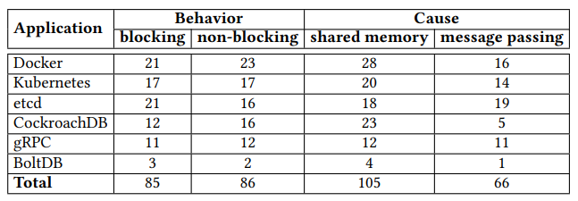
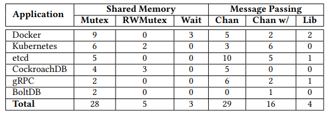

====================================================
Understanding Real-World Concurrency Bugs in Go
====================================================

* https://songlh.github.io/paper/go-study.pdf
* https://github.com/system-pclub/go-concurrency-bugs

Abstract
====================================================

* Go の並行処理に関するバグの研究
* Go のマルチスレッドプログラミングの並行化メカニズム
    * メッセージパッシング
    * 共有メモリ
* Go で実装されたメジャーなプロダクト(Docker, Kebernetes, etcd, CockroachDB, gRCP, BoltDB)が調査対象
* 171 個の並行処理に関するバグがあり、伝統的なバグと伝統的なバグではない Go 特有のバグ
    * 半数以上は Go 特有のバグ
* 調査するために Bug 検出器を使って検証/評価した

1 Introduction
====================================================

* バグの原因
    * 共有メモリ
        * traditional(Mutex, RWMutex)
        * WaitGroup
    * メッセージパッシングの誤用
        * チャネル
* バグの種類
    * ブロッキングバグ
        * goroutine がブロックされてしまうバグ
    * ノンブロッキングバグ
        * 処理自体は進むが意図しない動作をするバグ
* ブロッキングバグの約 58 %はメッセージパッシングが原因
    * どのゴルーチンも Read していないチャネルにメッセージを送信
    * ...

-----

* バグの例

タイムアウトすると ``time.After(timeout)`` からチャネルが return されてメインのルーチンは抜けるけど、ゴルーチンは残っている。後にゴルーチンはチャネルに書き込もうとするが、チャネルを受信するルーチンがいないので、チャネルへの書き込みがブロックされる。ゴルーチンリークにつながる。バッファ付きチャネルにすることで結果をチャネルに書き込むことができる。

.. code-block:: diff
    :caption: Kubernetes Figure 1. A blocking bug caused by channel.

    func finishReq(timeout time.Duration) r ob {
    -	ch := make(chan ob)
    +	ch := make(chan ob, 1)
        go func() {
            result := fn()
            ch <- result // block
        }()
        select {
        case result = <-ch:
            return result
        case <-time.After(timeout):
            return nil
        }
    }

2 Background and Applications
====================================================

* Go は静的型付けの言語で並行プログラミング用に設計されている
* スレッドモデル、スレッド間の通信方法、スレッド同期メカニズム、Go の並行処理のメカニズムの説明
* 6 つのアプリケーションの紹介

2.1 Goroutine
----------------------------------------------------

* Goroutine の説明
    * ゴルーチンは匿名関数の実行をサポートしていて、親と変数を共有することができる
        * データ競合をもたらす

2.2 Synchronization with Shared Memory
----------------------------------------------------

* 従来の共有メモリアクセスのサポート
    * ロックとロックの解除(sync.Mutex)
    * 書き込み、読み込みロック(RWMutex)
    * 条件変数(Cond)
    * アトミックな読み取り、書き込み(Atomic)
* 複数のゴルーチンが一度だけ実行する
    * Go の新しいプリミティブ(``WaitGroup``)
    * Once.Do(f)
* 複数のゴルーチンの待機
    * 誤用するとブロッキングバグとノンブロッキングの両方が発生する可能性がある

.. todo:: sync パッケージから調べる

2.3 Synchronization with Message Passing
----------------------------------------------------

* チャネル(``chan``)
    * Goによって導入された新しい並行性プリミティブ
    * ゴルーチン間のデータと状態の送受信
    * nil チャネルへのデータ送信またはデータの受信は、ゴルーチンをブロックする
    * close されたチャネルを再度 close すると実行時パニックを起こす可能性がある
* ``select``
    * ゴルーチンの複数チャネルの待機
    * 複数のケースが有効な場合は非決定的(ランダムに決まる)
        * 並行バグを引き起こしうる
* ``context``
    * ゴルーチン間でリクエストデータやメタデータを伝播
* ``Pipe``
    * ``Reader`` と ``Writer`` 間のストリームデータのやり取り
    * 新しいタイプの並行バグを生み出しうる

2.4 Go Applications
----------------------------------------------------

* Go の人気と採用が増えている話

3 Go Concurrency Usage Patterns
====================================================

3.1 Goroutine Usages
----------------------------------------------------

3.2 Concurrency Primitive Usages
----------------------------------------------------

4 Bug Study Methodology
====================================================

* 並行バグの分類

.. list-table:: バグの分類 * 原因
     :header-rows: 1

     * - 分類
       - メッセージパッシング
       - 共有メモリ
       - 合計
     * - ブロッキングバグ
       - 49
       - 36
       - 85
     * - ノンブロッキングバグ
       - 17
       - 69
       - 86
     * - 合計
       - 66
       - 105
       - 171

5 Blocking Bugs
====================================================

* ブロッキングバグに関する調査結果

5.1 Root Causes of Blocking Bugs
----------------------------------------------------

* 約 42 %は共有メモリの保護エラーが原因
* 約 58 %はメッセージパッシングのエラーが原因
* 共有メモリプリミティブはメッセージパッシングプリミティブよりも頻繁に使用される
* メッセージパッシングはブロッキングバグを引き起こしやすくなる

5.1.1 (mis)Protection of Shared Memory
^^^^^^^^^^^^^^^^^^^^^^^^^^^^^^^^^^^^^^^^^^^^^^^^^^^^

* ``WaitGroup`` の誤用によるバグの例
    * ループの中で ``group.Wait()`` しているためループが回らず、ブロックされてしまう
    * ループの外に出すことでバグは Fix される

.. code-block:: diff
    :caption: Docker Figure 5. A blocking bug caused by WaitGroup.

    var group sync.WaitGroup
    group.Add(len(pm.plugins))
    for _, p := range pm.plugins {
        go func(p *plugin) {
            defer group.Done()
        }
        // len(pm.plugins) 分の group.Done を待つのでブロックされてしまう
    -   group.Wait()
    }
    +group.Wait()

5.1.2 Misuse of Message Passing
^^^^^^^^^^^^^^^^^^^^^^^^^^^^^^^^^^^^^^^^^^^^^^^^^^^^

* コンテキストオブジェクトを別のコンテキストオブジェクトで上書きしてしまうことで、古いオブジェクトを使っているゴルーチンにメッセージを送信/closeすることできなくなる

.. code-block:: diff
    :caption: Figure 6. A blocking bug caused by context.

    -hctx, hcancel := context.WithCancel(ctx)
    +var hctx context.Context
    +var hcancel context.CancelFunc
    if timeout > 0 {
        hctx, hcancel = context.WithTimeout(ctx, timeout)
    +} else {
    +   hctx, hcancel = context.WithCancel(ctx)
    }

* チャネルを使うことの考慮不足によるブロッキングバグ
    * 関数の実行順序(``gorotine1()`` => ``goroutine2()``)によっては永久にブロックされる
    * ``select`` の ``default`` を使うことでFixした

.. code-block:: diff
    :caption: Figure 7. A blocking bug caused by wrong usage of channel with lock.

    func gorotine1() {
        m.Lock()
        // goroutine2() がまだチャネルをReadしていないと、リクエストが書き込めないためブロックされる
    -    ch <- request
    +    select {
    +    case ch <- request:
        // default を用いることで書き込めない場合は何も処理せずアンロックする
    +    default:
    +    }
        m.Unlock()
    }

    func goroutine2() {
        for {
            // ブロックされる
            m.Lock()
            m.Unlock()
            request <-ch
        }
    }

5.2 Fixes of Blocking Bugs
----------------------------------------------------

5.3 Detection of Blocking Bugs
----------------------------------------------------

6 Non-Blocking Bugs
====================================================

* ノンブロッキングバグの調査

6.1 Root Causes of Non-blocking Bugs
----------------------------------------------------

* ノンブロッキングバグも、ブロッキングバグと同様に共有メモリの保護によるバグとメッセージパッシングに関するエラーに分類

6.1.1 Failing to Protect Shared Memory
^^^^^^^^^^^^^^^^^^^^^^^^^^^^^^^^^^^^^^^^^^^^^^^^^^^^

* データ競合によるバグ

.. code-block:: diff
    :caption: Figure 8. A data race caused by anonymous function.

    for i := 17; i <= 21; i++ { // write
        // 無名関数の中で外側から変数をキャプチャしてゴルーチン内で使用している
        // この場合は変数のメモリアドレスを参照する
        // ゴルーチンの中で変数を参照するときには変数のアドレスが更新されていて、意図した値が取得できない
        // 関数で引数として値をコピーすることでFixできる
    -   go func() { /* Create a new goroutine */
    +   go func(i int) {
            apiVersion := fmt.Sprintf("v1.%d", i) // read
            // ...
    -   }()
    +   }(i)

.. code-block:: diff
    :caption: Figure 9. A non-blocking bug caused by misusing WaitGroup.

    func (p *peer) send() {
        p.mu.Lock()
        defer p.mu.Unlock()
        switch p.status {
        case idle:
            // ゴルーチンの中で Add したとしても先にメインルーチンが Wait に到達するとゴルーチンを待つことができない
            // ゴルーチンを呼び出す前に Add することで Fix できる
    +       p.wg.Add(1)
            go func() {
    -           p.wg.Add(1)
                ...
                p.wg.Done()
            }()
        case stopped:
        }
    }

6.1.2 Errors during Message Passing
^^^^^^^^^^^^^^^^^^^^^^^^^^^^^^^^^^^^^^^^^^^^^^^^^^^^

* メッセージパッシングでエラーが発生するとノンブロッキングバグが発生する
* ノンブロッキングバグの約 20 %を占める

.. code-block:: diff
    :caption: Docker#24007 Figure 10. A bug caused by closing a channel twice.

    -	select {
    -	case <- c.closed:
        // 複数のゴルーチンが同時に close すると panic が起こる
        // Once.Do を用いることで確実に一度だけ close することができる
    -	default:
    +		Once.Do(func() {
                close(c.closed)
    +		})
    -	}

* ``select`` の非決定的選択による不具合
    * チャネルが close されたとしてもタイミングによっては重い処理 f() が再度実行されてしまう

.. code-block:: diff
    :caption: Figure 11. A non-blocking bug caused by select and channel.

    ticker := time.NewTicker()
    for {
    +	select {
    +	case <-stopCh:
    +		return
    +	default:
    +	}
    	f()
    	select {
    	case <-stopCh:
    		return
    	case <-ticker:
    	}
    }

* ライブラリの中でチャネルを使用することによるノンブロッキングバグ
* 開発者は dur が 0 より大きい、または ``ctx.Done()`` が呼ばれた場合のみ関数から return することを意図している

.. code-block:: diff
    :caption: Figure 11. A non-blocking bug caused by select and channel.

    -timer := time.NewTimer(0)
    +var timeout <- chan time.Time
    if dur > 0 {
    -   timer = time.NewTimer(dur)
    +    timeout = time.NewTimer(dur).C
    }

    select {
    -case <- timer.C:
    +case <- timeout:
    case <- ctx.done():
        return nil
    }

6.2 Fixes of Non-Blocking Bugs
----------------------------------------------------

6.3 Detection of Non-Blocking Bugs
----------------------------------------------------

7 Discussion and Future Work
====================================================

8 Related Works
====================================================

9 Conclusion
====================================================

その他参考
====================================================

* https://speakerdeck.com/keitatomozawa/concurrency-bugsnituitefalselun-wen-wodu-mu
